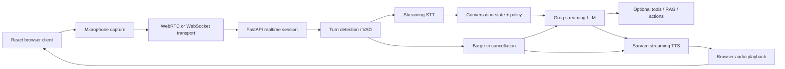

# Gen AI Voice Agent Design Research

Date: 2026-05-19

This document summarizes design patterns for building a Gen AI voice agent and maps them to this repository's current architecture. The current project is a chained FastAPI + React application: the user sends text, Groq generates a response, and Sarvam AI converts that response to speech. The next design step is to decide whether the app should remain a simple chained pipeline or evolve into a real-time spoken conversation system with microphone input, streaming transcription, turn detection, interruption handling, and observability.

## Current Project Shape

Current local stack:

- `backend/`: FastAPI service with route modules for text generation, Sarvam TTS, and combined voice-agent responses.
- `frontend/`: React + Vite client.
- LLM provider: Groq.
- TTS provider: Sarvam AI Bulbul V3.
- Current interaction pattern: text input -> LLM response -> TTS output.

This is a good early architecture because it is easy to reason about, easy to debug, and exposes transcripts naturally. It is not yet a full voice agent in the production sense because it does not accept live microphone audio, does not perform streaming speech-to-text, does not detect turns, and cannot gracefully handle barge-in while audio is playing.

## Core Design Choice

There are two main voice-agent architecture families.

### 1. Native Speech-to-Speech

In this pattern, a realtime multimodal model directly receives audio and emits audio. The model can use audio features such as tone, interruptions, and prosody without relying only on text transcripts. OpenAI's Realtime API and Agents SDK are examples of this model-first approach.

Use this when:

- Low latency and natural conversation are more important than full transcript control.
- The app is a live assistant, tutor, support agent, or discovery agent.
- The team wants built-in realtime events, VAD, interruptions, tools, guardrails, and handoffs from the agent framework.

Tradeoffs:

- Less provider independence.
- More session/event complexity.
- Some behavior is controlled by the realtime model and transport rather than ordinary request-response code.

### 2. Chained STT -> LLM -> TTS

In this pattern, the system converts speech to text, sends text to an LLM, then converts the LLM response to speech. This is the pattern closest to the current repo, except the current app starts at text input rather than live STT.

Use this when:

- You need transcript visibility and deterministic business logic.
- You want to mix providers, such as Groq for LLM and Sarvam for TTS/STT.
- You need easier moderation, logging, retrieval, scripted flows, or explicit tool calls.
- You are still validating product behavior before optimizing real-time conversation quality.

Tradeoffs:

- Latency accumulates across STT, LLM, TTS, buffering, and network hops.
- Turn-taking and interruption logic must be implemented or delegated to a voice framework.
- A naive sequential chain feels slow because each stage waits for the previous stage to finish.

For this project, the recommended near-term design is an improved chained architecture. It matches the existing code, keeps provider control, and can become progressively more realtime by adding streaming STT, streaming LLM output, and streaming TTS.

## Recommended Target Architecture



The important design pattern is not just "call three APIs." A production voice agent is an event-driven streaming system. Audio, partial transcripts, turn events, LLM tokens, tool events, TTS chunks, playback state, and interruptions all need to move through the system without blocking each other.

## Design Patterns

### 1. Keep the Chained Pipeline, but Make Each Stage Streaming

Current behavior appears mostly request-response: generate the full text, then synthesize speech. That is simple, but it increases perceived latency.

Better pattern:

- Stream user audio to STT in short chunks.
- Emit partial/final transcript events.
- Start LLM generation as soon as the user turn is confidently complete.
- Stream LLM tokens or short sentence fragments into TTS.
- Start audio playback before the full assistant response is finished.

This overlaps work. The user hears the first response audio while the model is still generating later text.

### 2. Treat Turn Detection as a First-Class Component

Voice agents fail when the system guesses wrong about when the user is done speaking. Use explicit VAD and endpointing parameters rather than arbitrary silence timeouts.

Design notes:

- Track `speech_started`, `speech_stopped`, `turn_final`, and `turn_forced` events.
- Tune minimum silence, maximum silence, VAD threshold, and endpoint confidence.
- Use longer end-of-turn windows when the user is reading numbers, addresses, names, or IDs.
- Keep push-to-talk as an optional fallback for noisy environments.

### 3. Implement Barge-In and Truncation

Users naturally interrupt. A voice agent should stop speaking quickly, cancel pending TTS, and ensure the conversation history reflects only what the user actually heard.

Design notes:

- When user speech begins during assistant playback, stop local audio immediately.
- Cancel any in-flight LLM/TTS generation if the new user turn changes intent.
- Record how much assistant audio was played.
- Avoid storing unplayed assistant text as if the user heard it.
- If exact truncation is hard, prefer short assistant utterances so interruption recovery is less awkward.

### 4. Use a Conversation State Machine for Business Flow

Free-form prompts alone are weak for voice workflows. A small explicit state machine keeps calls predictable.

Example states:

- `idle`: waiting for user input.
- `listening`: capturing live audio.
- `transcribing`: STT is producing interim text.
- `thinking`: LLM/tool work is running.
- `speaking`: TTS output is playing.
- `interrupted`: user spoke during playback.
- `handoff`: agent cannot safely complete the task.
- `error_recovery`: provider or network failure.

Each state should define allowed events and cancellation behavior.

### 5. Keep Agent Replies Short

Voice UX is not chat UX. Long paragraphs sound slow and make interruption handling worse.

Prompt and policy guidance:

- Prefer one to three sentences per response.
- Ask one question at a time.
- Confirm before taking irreversible actions.
- Say uncertainty plainly.
- Use tools only when needed.
- Prefer concise summaries over reading large retrieved text aloud.

### 6. Separate Session Control from Provider Calls

Do not let route handlers become the entire orchestration layer. Keep the existing route structure, but add a small session/service layer when realtime voice is introduced.

Suggested modules:

- `voice_session.py`: session state, event handling, cancellation.
- `stt_service.py`: provider wrapper for STT.
- `llm_service.py`: Groq wrapper, streaming output, tool-call policy.
- `tts_service.py`: Sarvam wrapper, streaming output.
- `conversation_policy.py`: prompt, state machine, safety and handoff rules.

This is not a request to refactor now. It is the recommended direction once microphone input and streaming sessions are added.

### 7. Prefer WebRTC for Browser Realtime Voice

For browser clients, WebRTC is usually the better transport for low-latency audio. WebSockets are still useful for server-to-provider event streams, telephony bridges, and simpler prototypes.

Pattern:

- Browser microphone capture through `getUserMedia`.
- WebRTC for realtime audio when possible.
- WebSocket or Server-Sent Events for structured backend events if the audio path remains HTTP/WebSocket based.
- For PSTN/phone calling, use SIP or a telephony provider bridge such as Twilio ConversationRelay.

### 8. Add Observability Before Tuning

Voice-agent latency is cumulative. Measure each segment before changing providers.

Track per interaction:

- Time to first user audio received.
- STT partial latency.
- End-of-turn detection latency.
- LLM time to first token.
- Tool-call latency.
- TTS time to first audio byte.
- Playback start time.
- End-to-end latency from user stop speaking to assistant start speaking.
- Interruption count and recovery success.
- Provider errors and retries.

### 9. Safety, Guardrails, and Handoff

Voice agents need guardrails because spoken answers feel more authoritative and are harder to inspect than text.

Recommended controls:

- Use a focused system prompt with the agent's exact job.
- Limit tools to the minimum needed.
- Validate tool arguments before execution.
- Add output rules for unsafe, medical, legal, financial, or identity-sensitive requests.
- Provide a handoff path when the agent lacks confidence or authority.
- Never expose provider API keys to the browser.
- Log enough transcript metadata for debugging, while respecting privacy.

### 10. Multilingual and Indian-Language Considerations

This project already uses Sarvam AI with Hindi defaults. If the target users include Indian-language speakers, keep language handling explicit.

Design notes:

- Detect or select language before STT/TTS.
- Keep `target_language_code`, speaker, pace, and sample rate configurable.
- Use STT phrase hints/keyterms for names, places, product terms, and code-mixed speech.
- Store the transcript language with each turn.
- Be careful with translation: for many workflows the agent should answer in the same language as the user.

## Suggested Implementation Phases

### Phase 1: Stabilize the Current Chained Agent

- Keep text input.
- Use Groq streaming responses if available in the selected SDK/API path.
- Use Sarvam streaming TTS endpoint consistently.
- Return generated text in the JSON body, not only in headers.
- Add request IDs and timing logs.
- Add user-facing errors for missing API keys and provider failures.

### Phase 2: Add Speech Input

- Add browser microphone capture.
- Add a backend STT endpoint or websocket session.
- Start with one STT provider and one language.
- Save transcript turns in memory for the session.
- Keep push-to-talk available during early testing.

### Phase 3: Realtime Conversation Loop

- Move to streaming STT.
- Add VAD/turn events.
- Add cancellation tokens for in-flight LLM and TTS work.
- Add local playback interruption.
- Keep assistant responses short.

### Phase 4: Production Hardening

- Add per-stage latency metrics.
- Add tool-call validation and guardrails.
- Add session cleanup and timeout handling.
- Add retry policies for transient provider failures.
- Add privacy rules for recordings, transcripts, and logs.
- Add load testing for concurrent sessions.

## Practical Recommendations for This Repo

1. Keep the current FastAPI route modules for now. They are simple and readable.
2. Add live STT as a new capability rather than mixing microphone upload logic into existing TTS routes.
3. Prefer a new session-oriented module when the app becomes realtime.
4. Keep Sarvam TTS streaming as the audio output path, since the repo already uses Sarvam and it supports streaming voice use cases.
5. Use Groq streaming chat completions when optimizing response latency.
6. Treat VAD and interruption handling as product features, not low-level implementation details.
7. Keep prompts short, task-specific, and voice-aware.
8. Add timing logs before making provider changes.

## Risk Register

| Risk | Why it matters | Mitigation |
| --- | --- | --- |
| Slow turn response | Users repeat themselves or talk over the agent | Stream every stage and measure stage latency |
| Bad endpointing | Agent cuts users off or waits too long | Tune VAD/turn thresholds and support push-to-talk |
| Barge-in failure | Conversation feels robotic | Stop playback immediately and cancel stale generation |
| Transcript drift | Agent remembers words the user never heard | Track played audio and avoid storing unplayed assistant text |
| Long responses | TTS becomes tiring and hard to interrupt | Prompt for short replies and one question at a time |
| Provider outage | Voice loop breaks mid-session | Timeouts, retries, fallback text response, graceful error audio |
| Browser audio permissions | User cannot start conversation | Clear permission handling and fallback text input |
| API key exposure | Security issue | Keep provider calls server-side |
| Multilingual mismatch | User speaks one language, agent answers another | Store language per turn and configure STT/TTS explicitly |
| Logging sensitive data | Privacy and compliance risk | Redact secrets, minimize retention, gate recording |

## Reference Architecture Summary

For this project, the best design pattern is:

```text
React client
  -> microphone capture / text fallback
  -> realtime session transport
  -> FastAPI session orchestrator
  -> VAD + streaming STT
  -> conversation policy + Groq streaming LLM
  -> Sarvam streaming TTS
  -> browser playback with interruption handling
  -> metrics + transcript storage with privacy rules
```

This keeps the project aligned with its existing Groq + Sarvam foundation while moving toward production-grade voice behavior incrementally.

## References

1. OpenAI, Voice agents: https://platform.openai.com/docs/guides/voice-agents
2. OpenAI, Realtime API voice design: https://platform.openai.com/docs/guides/realtime/voice-design
3. OpenAI, Realtime conversations: https://platform.openai.com/docs/guides/realtime-conversations
4. OpenAI, Realtime model capabilities: https://platform.openai.com/docs/guides/realtime-model-capabilities
5. OpenAI, Realtime API with SIP: https://platform.openai.com/docs/guides/realtime-sip
6. OpenAI Agents SDK JS, Voice Agents: https://openai.github.io/openai-agents-js/guides/voice-agents/
7. OpenAI Agents SDK JS, Building Voice Agents: https://openai.github.io/openai-agents-js/guides/voice-agents/build/
8. OpenAI Agents SDK JS, Guardrails: https://openai.github.io/openai-agents-js/guides/guardrails/
9. OpenAI Agents SDK Python, Realtime guide: https://openai.github.io/openai-agents-python/realtime/guide/
10. OpenAI realtime agents example repository: https://github.com/openai/openai-realtime-agents
11. OpenAI Realtime prompting guide PDF: https://cdn.openai.com/API/docs/realtime-prompting-guide.pdf
12. LiveKit, Voice Agent Architecture: https://livekit.com/blog/voice-agent-architecture-stt-llm-tts-pipelines-explained
13. LiveKit Agents JS reference: https://docs.livekit.io/reference/agents-js
14. LiveKit, Voice agents: https://livekit.com/voice-agents
15. LiveKit, Building voice agents: https://docs.livekit.io/agents/v0/voice-agent/voice-pipeline
16. Twilio, ConversationRelay product overview: https://www.twilio.com/en-us/products/conversational-ai/conversationrelay
17. Twilio, ConversationRelay TwiML docs: https://www.twilio.com/docs/voice/twiml/connect/conversationrelay
18. Twilio, ConversationRelay AWS reference architecture: https://www.twilio.com/en-us/blog/conversation-relay-aws-reference-architecture
19. Twilio, Fargate and Bedrock ConversationRelay architecture: https://www.twilio.com/en-us/blog/developers/tutorials/product/reference-architecture-aws-conversationrelay-voice-ai-app
20. Deepgram, Flux voice agent guide: https://developers.deepgram.com/docs/flux/agent
21. ElevenLabs, ElevenAgents introduction: https://elevenlabs.io/docs/conversational-ai/docs/introduction
22. ElevenLabs, Conversational AI WebSocket docs: https://elevenlabs.io/docs/conversational-ai/libraries/web-sockets
23. ElevenLabs help, Conversational AI overview: https://help.elevenlabs.io/hc/en-us/articles/29297698405905-What-is-Conversational-AI
24. Pipecat, Overview: https://docs.pipecat.ai/pipecat/learn/overview
25. Pipecat, Introduction: https://docs.pipecat.ai/overview/introduction
26. Pipecat, Pipeline and frame processing: https://docs.pipecat.ai/guides/learn/pipeline
27. Pipecat, Quickstart: https://docs.pipecat.ai/pipecat/get-started/quickstart
28. Vapi, Core models quickstart: https://docs.vapi.ai/quickstart
29. Vapi, Orchestration models: https://docs.vapi.ai/how-vapi-works
30. AssemblyAI, Universal Streaming: https://www.assemblyai.com/docs/streaming/universal-streaming
31. AssemblyAI, Universal Streaming API reference: https://www.assemblyai.com/docs/api-reference/streaming-api/universal-streaming
32. Google Cloud, Voice activity events and timeouts: https://cloud.google.com/speech-to-text/v2/docs/voice-activity-events
33. Google Cloud, Speech-to-Text overview: https://docs.cloud.google.com/speech-to-text/docs/speech-to-text-requests
34. Amazon Transcribe, Streaming and partial results: https://docs.aws.amazon.com/transcribe/latest/dg/streaming-partial-results.html
35. Amazon Transcribe, Streaming audio: https://docs.aws.amazon.com/transcribe/latest/dg/streaming.html
36. NVIDIA Riva, ASR overview: https://docs.nvidia.com/deeplearning/riva/user-guide/docs/asr/asr-overview.html
37. MDN, WebRTC API: https://developer.mozilla.org/en-US/docs/Web/API/WebRTC_API
38. MDN, MediaDevices.getUserMedia: https://developer.mozilla.org/en-US/docs/Web/API/MediaDevices/getUserMedia
39. RFC 8831, WebRTC Data Channels: https://www.rfc-editor.org/rfc/rfc8831
40. Sarvam AI, Text-to-Speech overview: https://docs.sarvam.ai/api-reference-docs/api-guides-tutorials/text-to-speech/overview
41. Sarvam AI, Speech-to-Text REST docs: https://docs.sarvam.ai/api-reference-docs/speech-to-text/transcribe
42. Groq, API reference: https://console.groq.com/docs/api-reference
43. Groq, Speech-to-Text docs: https://console.groq.com/docs/speech-to-text
44. Groq, Text generation docs: https://console.groq.com/docs/text-chat
45. Cartesia, API docs: https://docs.cartesia.ai/
46. Cartesia, Sonic low-latency voice model: https://cartesia.ai/blog/sonic
47. Retell AI, Webhook overview: https://docs.retellai.com/features/webhook-overview
48. Retell AI, Check actual latency: https://docs.retellai.com/reliability/check-actual-latency
49. arXiv, Building Enterprise Realtime Voice Agents from Scratch: https://arxiv.org/abs/2603.05413
50. arXiv, VoiceAgentRAG latency bottleneck paper: https://arxiv.org/abs/2603.02206
