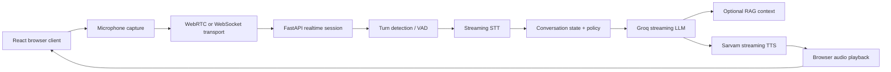

# Lyra Voice AI — Design & UI Research

Date: 2026-05-23
Product: Lyra — Voice-first AI for Indic languages
Stack: React + Vite + TypeScript + FastAPI

## Overview
Lyra is a voice-first AI application designed for the 900 million Indians who deserve AI in their native language. This document outlines the architectural design and the premium UI/UX patterns that define the Lyra experience.

## Visual Identity & Design System

### Core Palette: Deep Space
Instead of pure black, Lyra uses a rich, dark navy base to create depth and a modern "intelligent" feel.
- **Base BG:** `hsl(228 22% 5%)` (#0b0d14 - Deep Space)
- **Surface:** `hsl(228 18% 8%)` (#111420)
- **Primary Accent:** `hsl(20 90% 55%)` (#f5622e - Lyra Orange)
- **Secondary Accent:** `hsl(175 80% 45%)` (#1ad6a0 - Teal)
- **Glow:** `hsl(20 90% 55% / 0.25)`

### UI Patterns
- **Aurora Gradients:** Slowly shifting blobs of violet, indigo, and teal behind hero sections to suggest the AI is "alive."
- **Glassmorphism:** Frosted glass cards with `backdrop-filter: blur(24px)` and subtle neon glow borders.
- **Bento Grid:** Asymmetric layouts for features to create visual hierarchy.
- **Noise Overlay:** A subtle grain (4% opacity) to add texture and a premium feel.

## Voice & Audio Visualization
Since Lyra is voice-first, the visualizer **is** the product. 

### Recommended Patterns:
1. **Pulsing Concentric Rings:** 3-5 rings pulsing outward from the mic button during recording (Sonar-style).
2. **Real-time Frequency Bars:** 32-64 vertical bars reacting to Web Audio API amplitude.
3. **Liquid Morphing Blob:** A breathing shape used during thinking/speaking phases to indicate processing.

## Architecture

### Current Stack
- **Frontend:** React (TypeScript) + Vite
- **Backend:** FastAPI
- **LLM:** Groq (Llama 3.3 70B)
- **TTS/STT:** Sarvam AI (Bulbul v3 / Saaras v3)
- **Vector DB:** ChromaDB (Local)

### Target Architecture (Streaming Loop)

## Implementation Roadmap (Priority Matrix)

| Order | Pattern | Effort | Impact |
| :--- | :--- | :--- | :--- |
| **1st** | **Lenis Smooth Scroll** | 30 min | ⭐⭐⭐⭐⭐ |
| **2nd** | **Aurora Gradient Blobs** | 1 hr | ⭐⭐⭐⭐⭐ |
| **3rd** | **Concentric Rings Visualizer** | 1 hr | ⭐⭐⭐⭐⭐ |
| **4th** | **Glassmorphism & New Palette** | 1 hr | ⭐⭐⭐⭐ |
| **5th** | **Bento Grid Features** | 3 hrs | ⭐⭐⭐⭐⭐ |
| **6th** | **Framer Motion Reveals** | 1.5 hr | ⭐⭐⭐⭐ |
| **7th** | **Streaming Text Animation** | 1 hr | ⭐⭐⭐⭐ |

## Design Principles

### 1. Voice-First UX
- Prefer one to three sentences per response.
- Use "Streaming Text" to mirror the LLM's thought process.
- Implement Barge-in (interruptions) so users can stop the AI naturally.

### 2. Indic Cultural Identity
- **Language-Switch Animations:** Unique entrance animations for different scripts (e.g., Hindi vs. Tamil).
- **Native Script Support:** Native rendering of 11+ Indic languages (Devanagari, Tamil, Telugu, etc.).

### 3. Low Latency "Wow" Factor
- Aim for **Sub-1.5s** total turn-around time.
- Use timing logs to measure STT -> LLM -> TTS segments.

## Risk Register
| Risk | Mitigation |
| :--- | :--- |
| Latency accumulation | Every stage must be streaming (STT/LLM/TTS). |
| Bad endpointing | Tune VAD thresholds; support push-to-talk fallback. |
| API Key Exposure | All provider calls must remain server-side via FastAPI proxy. |
