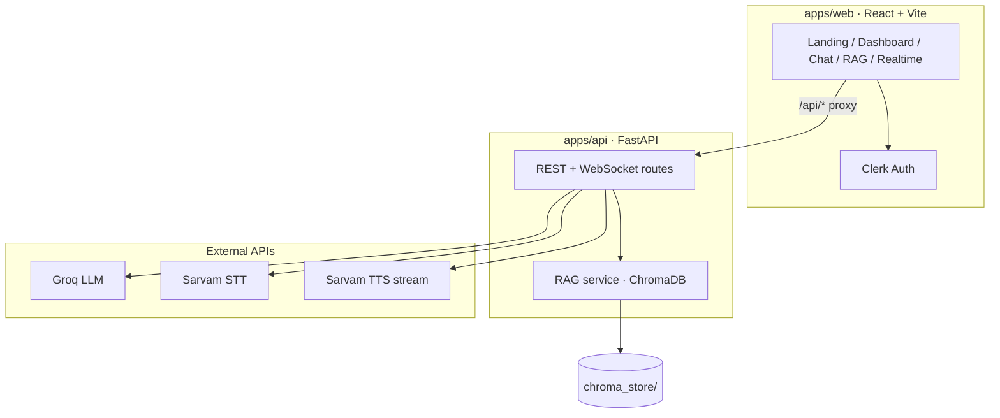

# Lyra · Gen AI Voice Agent

**Voice-first AI for Bharat** — speak or type in Hindi, Tamil, Telugu, and other Indic languages. Lyra transcribes with Sarvam STT, reasons with Groq LLM (optionally grounded on your documents via RAG), and responds with natural Sarvam TTS.

<p align="center">
  
  
  
  
  
</p>

---

## Table of contents

- [Overview](#overview)
- [Features](#features)
- [Architecture](#architecture)
- [Repository layout](#repository-layout)
- [Prerequisites](#prerequisites)
- [Quick start](#quick-start)
- [Configuration](#configuration)
- [API reference](#api-reference)
- [Knowledge base (RAG)](#knowledge-base-rag)
- [Development](#development)
- [Further reading](#further-reading)

---

## Overview

Lyra is a full-stack voice agent built for **low-latency, multilingual conversation** in the Indic context. The system supports:

- **Batch voice pipeline** — record → STT → LLM → streamed TTS
- **Real-time voice** — WebSocket session with streaming LLM tokens and sentence-chunked TTS playback
- **Grounded answers** — local ChromaDB retrieval over your `.txt` / `.md` knowledge files
- **Authenticated dashboard** — Clerk-protected React app with chat, RAG manager, and realtime voice UI

Agent behavior (persona, guardrails, latency targets) is defined in [`AGENTS.md`](./AGENTS.md). UI and design system notes live in [`DESIGN.md`](./DESIGN.md).

---

## Features

| Area | Capability |
|------|------------|
| **Speech** | Sarvam Saaras v3 STT · Bulbul v3 TTS (`ratan` speaker, configurable pace/pitch) |
| **Reasoning** | Groq streaming LLM (`llama-3.3-70b-versatile` default, preset profiles in `config.py`) |
| **Realtime** | `WS /api/realtime/ws` — token streaming + PCM audio back to the browser |
| **RAG** | Upload, ingest, and query documents via REST; context injected into voice + realtime flows |
| **Frontend** | Landing, dashboard, chatbot, RAG manager, realtime voice page · Lenis smooth scroll · Clerk auth |
| **Voice UX** | “Rule of Three” responses (≤3 sentences, ≤1 question) tuned for spoken output |

---

## Architecture



**Typical voice turn (batch):**

```
Microphone → POST /api/transcribe → POST /api/voice-agent-stream → audio playback
                      ↘ optional RAG context ↗
```

**Realtime turn:**

```
Browser WS → /api/realtime/ws → Groq stream → sentence queue → Sarvam TTS PCM → browser
```

All provider keys stay **server-side**; the frontend talks only to your FastAPI backend.

---

## Repository layout

```
gen-ai-voice-agent/
├── apps/
│   ├── api/                          # FastAPI backend (run uvicorn from here)
│   │   ├── main.py                   # App factory, CORS, router registration
│   │   ├── config.py                 # Settings + LLM/TTS presets
│   │   ├── schemas.py                # Pydantic models
│   │   ├── requirements.txt
│   │   ├── .env.example
│   │   ├── routes/
│   │   │   ├── stt.py                # Speech-to-text
│   │   │   ├── tts.py                # Text-to-speech stream
│   │   │   ├── text_generation.py    # Groq text generation
│   │   │   ├── voice_agent.py        # Combined voice pipeline + RAG variant
│   │   │   ├── rag.py                # Knowledge-base CRUD + ingest + query
│   │   │   ├── realtime.py           # WebSocket realtime voice
│   │   │   └── utils.py              # Health, configs
│   │   ├── services/                 # RAG, document loading, TTS helpers
│   │   ├── db/                       # Chroma CLI utilities
│   │   └── rag/
│   │       ├── data/                 # Drop knowledge files here
│   │       ├── chroma_store/         # Local vector store (gitignored)
│   │       ├── ingest.py             # CLI: python rag/ingest.py
│   │       └── query.py
│   └── web/                          # React + Vite + TypeScript
│       ├── src/
│       │   ├── pages/                # Landing, Dashboard, Chatbot, RAG, Realtime
│       │   ├── components/           # SmoothScroll, StreamingText, UI primitives
│       │   └── api.ts                # Typed fetch helpers
│       └── vite.config.ts            # Dev proxy → localhost:8000
├── knowledge/docs/                   # Optional shared docs (legacy path)
├── tests/
├── AGENTS.md                         # Lyra persona & guardrails
├── DESIGN.md                         # UI/UX design system
└── README.md
```

---

## Prerequisites

| Requirement | Version / notes |
|-------------|-----------------|
| **Python** | 3.10+ |
| **Node.js** | 18+ (20 LTS recommended) |
| **Groq API key** | [console.groq.com](https://console.groq.com) |
| **Sarvam API key** | [sarvam.ai](https://www.sarvam.ai) |
| **Clerk** (frontend auth) | [clerk.com](https://clerk.com) — publishable key for Vite |
| **ChromaDB** (RAG only) | `pip install chromadb` — not bundled in `requirements.txt` today |

---

## Quick start

### 1. Clone and configure the API

```bash
git clone https://github.com/Gaurav7974/Gen-Ai-Voice-agent.git
cd Gen-Ai-Voice-agent/apps/api

python -m venv venv
# Windows
venv\Scripts\activate
# macOS / Linux
# source venv/bin/activate

pip install -r requirements.txt
pip install chromadb   # required for RAG endpoints

copy .env.example .env   # Windows
# cp .env.example .env   # macOS / Linux
```

Edit `.env` and set at minimum:

```env
GROQ_API_KEY=...
SARVAM_API_KEY=...
```

Start the API (from `apps/api`):

```bash
uvicorn main:app --reload --host 0.0.0.0 --port 8000
```

- Swagger UI: [http://localhost:8000/docs](http://localhost:8000/docs)
- Health: [http://localhost:8000/health](http://localhost:8000/health)

### 2. Start the web app

```bash
cd ../web
npm install
```

Create `apps/web/.env.local`:

```env
VITE_CLERK_PUBLISHABLE_KEY=pk_test_...
```

```bash
npm run dev
```

Open [http://localhost:5173](http://localhost:5173). Vite proxies `/api` to `http://localhost:8000`.

### 3. Smoke test

1. Sign up / sign in via Clerk → land on **Dashboard**
2. **Chat** — run the batch voice agent (STT → LLM → TTS)
3. **Real-time Voice** — open the WebSocket session at `/realtime`
4. **Knowledge Base** — upload a `.md` file, run ingest, ask a grounded question

---

## Configuration

### Backend (`apps/api/.env`)

| Variable | Default | Description |
|----------|---------|-------------|
| `GROQ_API_KEY` | — | Groq API key (**required**) |
| `SARVAM_API_KEY` | — | Sarvam API key (**required**) |
| `LLM_MODEL` | `llama-3.3-70b-versatile` | Default Groq model |
| `LLM_TEMPERATURE` | `0.7` | Sampling temperature |
| `LLM_MAX_TOKENS` | `1024` | Max completion tokens |
| `TTS_SPEAKER` | `ratan` | Sarvam Bulbul v3 voice |
| `TTS_LANGUAGE` | `hi-IN` | BCP-47 language code |
| `TTS_MODEL` | `bulbul:v3` | TTS model id |
| `TTS_PACE` | `1.1` | Speech rate |
| `HOST` / `PORT` | `0.0.0.0` / `8000` | Server bind |

Named presets (`default`, `creative`, `precise`, `fast`, `detailed` for LLM; `default`, `calm`, `energetic`, etc. for TTS) are defined in `apps/api/config.py` and exposed at `GET /api/configs`.

### Frontend

| Variable | Description |
|----------|-------------|
| `VITE_CLERK_PUBLISHABLE_KEY` | Clerk publishable key for `ClerkProvider` |

---

## API reference

| Method | Path | Description |
|--------|------|-------------|
| `GET` | `/` | Service welcome |
| `GET` | `/health` | Liveness check |
| `GET` | `/api/configs` | LLM + TTS preset catalog |
| `POST` | `/api/generate-text` | Groq text completion |
| `POST` | `/api/transcribe` | Sarvam STT (multipart audio) |
| `POST` | `/api/synthesize-speech-stream` | Sarvam TTS audio stream |
| `POST` | `/api/voice-agent-stream` | Prompt → LLM → streamed TTS |
| `POST` | `/api/voice-agent-combined` | Prompt → LLM → TTS as JSON + audio URL |
| `POST` | `/api/voice-agent-with-rag` | Voice agent with retrieved context |
| `WS` | `/api/realtime/ws` | Realtime bidirectional voice session |
| `GET` | `/api/rag/files` | List knowledge files |
| `POST` | `/api/rag/upload` | Upload document |
| `DELETE` | `/api/rag/files/{filename}` | Remove document |
| `POST` | `/api/rag/ingest` | Chunk, embed, upsert to Chroma |
| `POST` | `/api/rag/query` | Semantic search over knowledge base |

Interactive docs: run the API and open `/docs`.

---

## Knowledge base (RAG)

1. Place `.txt` or `.md` files in `apps/api/rag/data/`
2. Ingest (either path):

```bash
# From apps/api
python rag/ingest.py
```

Or trigger ingestion from the **Knowledge Base** UI / `POST /api/rag/ingest`.

3. Query via `POST /api/rag/query` or use chat / voice endpoints that inject retrieved chunks.

Chunks are sized for voice prompts (~900 chars, 120 overlap). The vector store persists under `apps/api/rag/chroma_store/` (gitignored).

---

## Development

```bash
# From repo root — API tests
pip install pytest httpx
pytest

# Frontend production build
cd apps/web && npm run build
```

| Script | Location | Command |
|--------|----------|---------|
| API dev server | `apps/api` | `uvicorn main:app --reload` |
| Web dev server | `apps/web` | `npm run dev` |
| Web build | `apps/web` | `npm run build` |
| RAG CLI query | `apps/api` | `python rag/query.py "your question"` |

**Latency targets** (see `AGENTS.md`): STT &lt; 400ms · LLM first token &lt; 300ms · TTS first byte &lt; 600ms · end-to-end &lt; 1.5s.

---

## Further reading

| Document | Contents |
|----------|----------|
| [`AGENTS.md`](./AGENTS.md) | Lyra persona, multilingual rules, guardrails |
| [`DESIGN.md`](./DESIGN.md) | Visual system, voice UI patterns, roadmap |
| [`apps/web/SETUP.md`](./apps/web/SETUP.md) | Extended setup notes (may reference older paths) |

---

## License

Licensed under the [MIT License](./LICENSE).
